Lab Guide
===

## Asset Overview
### Goal
Understand the importance of creating and defining assets to be monitored.

### Steps
1. Log into your CSP account
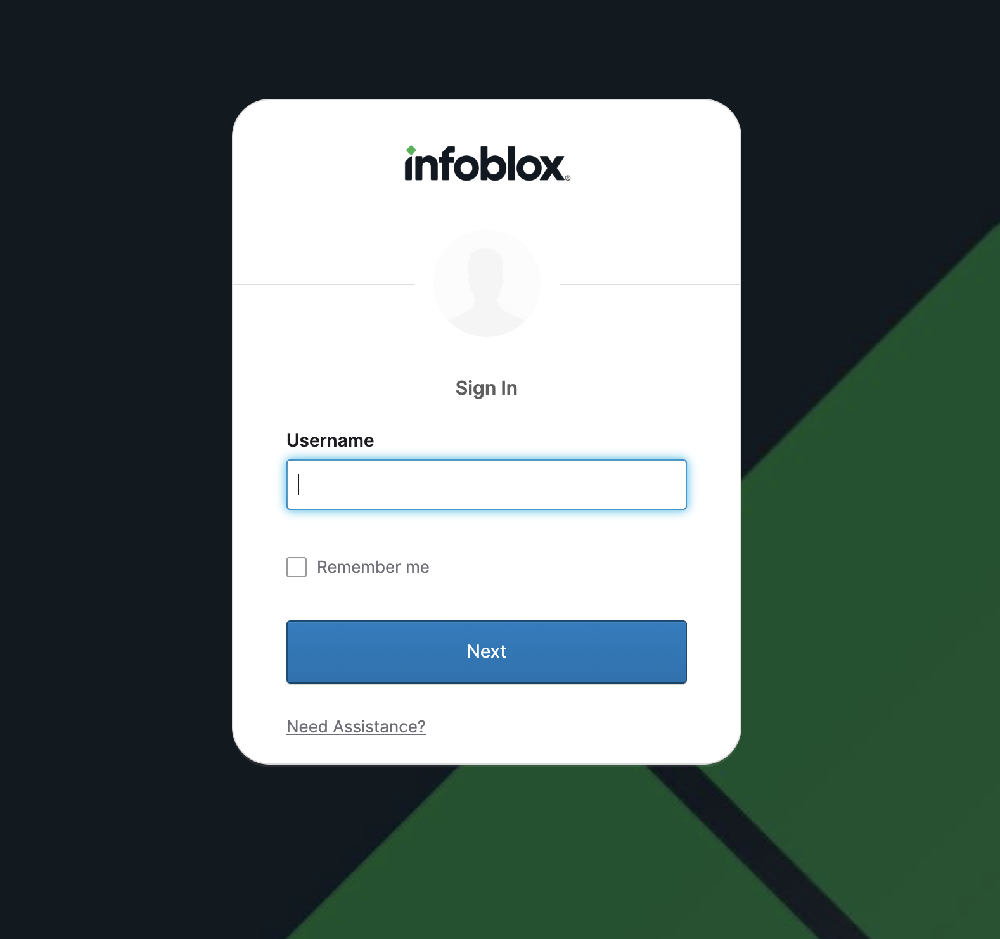
2. On the left panel click on the Axur icon
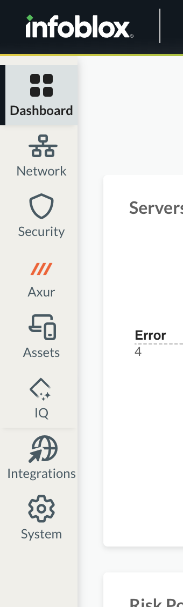
3. Navigate to Settings > Monitoring Settings
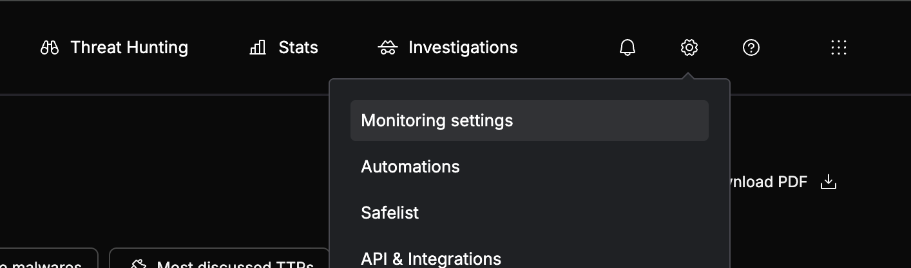
4. Select Asset Management
5. Select one of the pre-configured Asset. (Demo Netflix)
6. Review the visible metadata, associated monitoring context, and any linked coverage areas
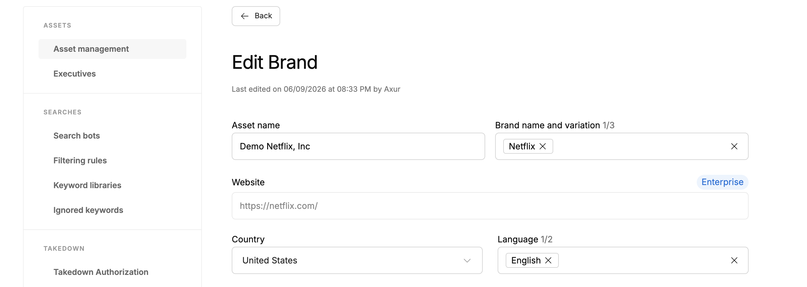

### What participants should observe
1. Which asset fields are visible (Note the configured website, country, language, and logos)
2. How a well defined asset can improve the monitoring and detection of asset.
3. Identify which threat types are enabled under brand protection.
4. Confirm whether Takedown Authorization is configured (Enabling it makes the Takedown action available for applicable tickets)

## Keyword Libraries
### Goal
Understand how configuring relevant brand keywords and variations can support brand protection and detection coverage while reducing irrelevant results.

### Steps
1. On the same page, Navigate to the keyword libraries option
2. Review any existing brand-related keyword libraries by clicking on the Edit icon. (Brand abuse related to Netflix)

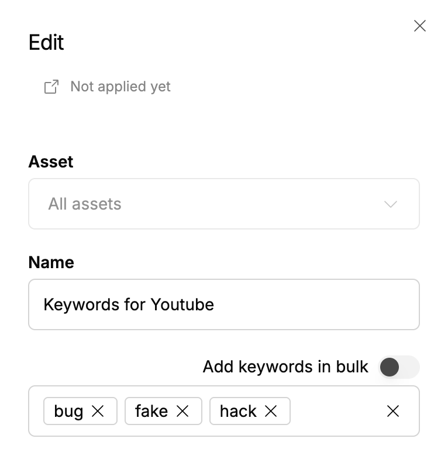

### What participants should observe
1. How keywords and keyword lists influence search bot queries
2. Why keyword quality affects monitoring relevance and false positives

## Filtering Rules
### Goal
Understand how to reduce noise and focus investigations. It is critical in a real-world analyst workflows because it improves prioritization and accelerates triage.

### Steps
1. On the same page, Navigate to Filtering rules
2. Review what filters already exist in the demo environment
3. From the drop-down select Detection type as Deep and Dark Web and Asset name as Netflix
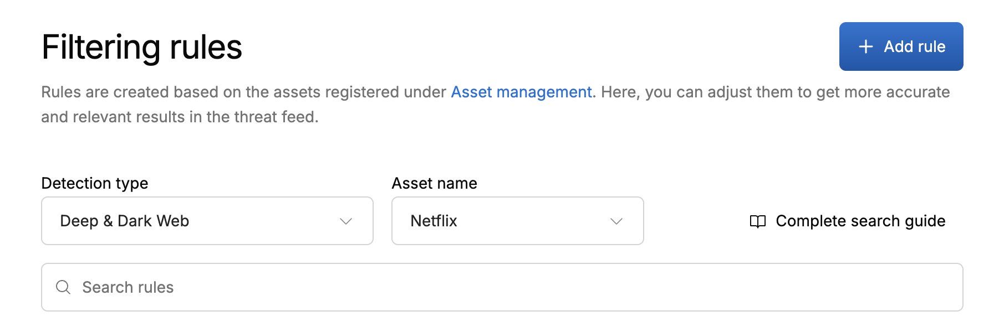
4. Observe how rules can refine visible findings by threat type, source, asset, or other relevant attributes
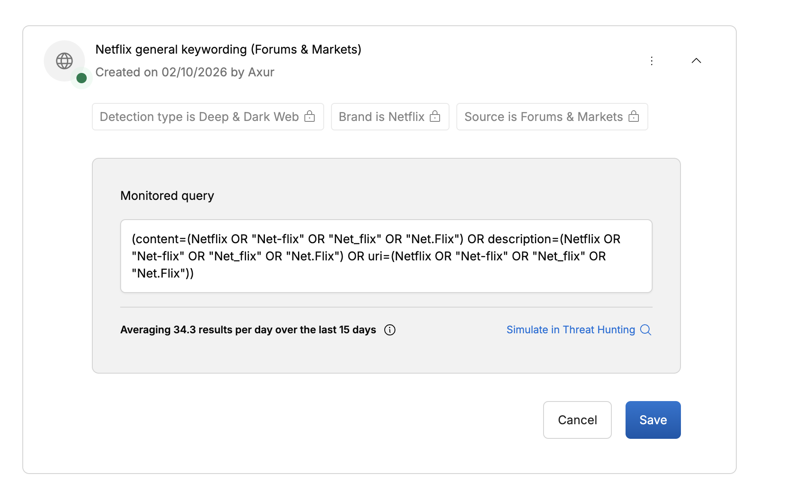

### Participant exercise
Identify which filters would be most useful for:
	• fake social profiles
	• fraudulent brand use

## Search Bots
### Goal
Configure search bots to regularly scan relevant sources using defined keywords and filters to identify brand threats.

### Steps
1. Navigate to Search Bots under Searches and open one of the available bots
2. For the Netflix use case, select the Fake accounts on Facebook bot configured
3. Review the bot configuration and outputs.

### This page defines:
- which asset it applies to
- which keyword library it uses
- what it searches for
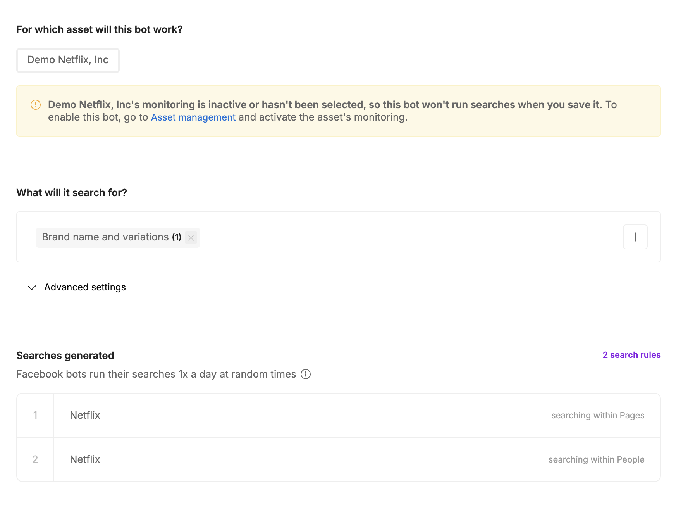

## Brand Protection
### Goal
Explore how Brand Protection detects impersonation, phishing, fraudulent websites, fake social profiles, and other misuse of the brand across external channels. How these findings can be investigated and progressed toward remediation or takedown.

### Ticket Types
#### Fake Social Media Profiles
**Steps**
1. Navigate to Workspaces > Brand Protection
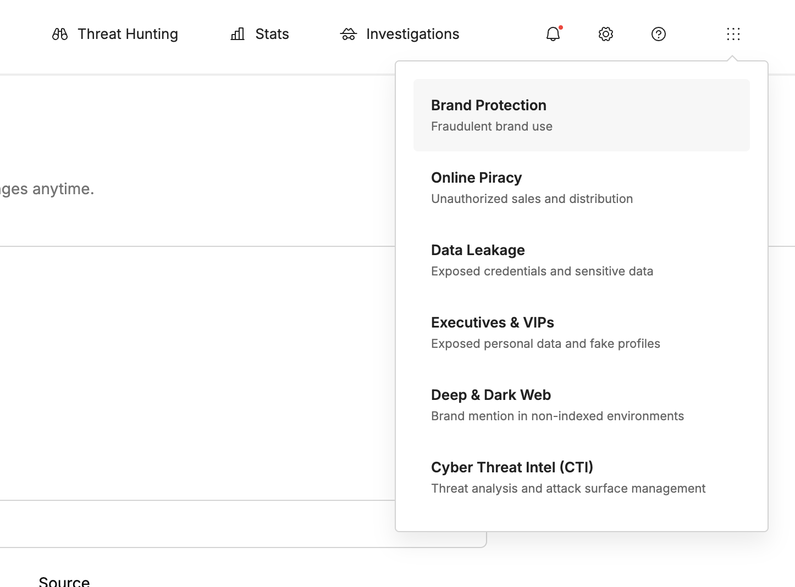
2. Filter by Ticket Type and select Fake social media profile
3. Open one sample ticket such as the seeded "Netflix Golden" example
4. Review the profile details, logo similarity, the risk level determined by Axur AI and the associated attributes shown in the ticket.
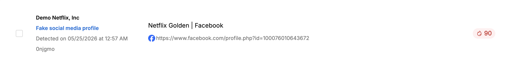

**Participants Task**
- Decide whether the ticket should be quarantined, escalated as an incident, discarded as a false positive, or sent for takedown after confirming authorization.

#### Fraudulent brand use in Incidents
**Steps**
1. Navigate to the Incidents tab
2. Open a ticket of type Fraudulent brand use
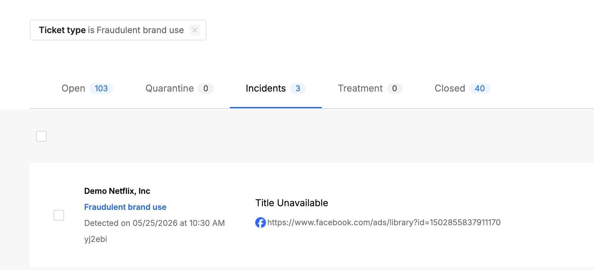
3. Review the evidence and current status
4. Walk through possible actions:
- Request for a takedown
- move to quarantine
- If it appears as a false positive move it to discard

**Participant exercise**
- Investigate one ticket and determine the next action for it.

#### Similar domain name in Quarantine state
**Steps**
1. Navigate to the Quarantine tab
2. Open similar domains findings
3. Review how domain lookalikes are presented
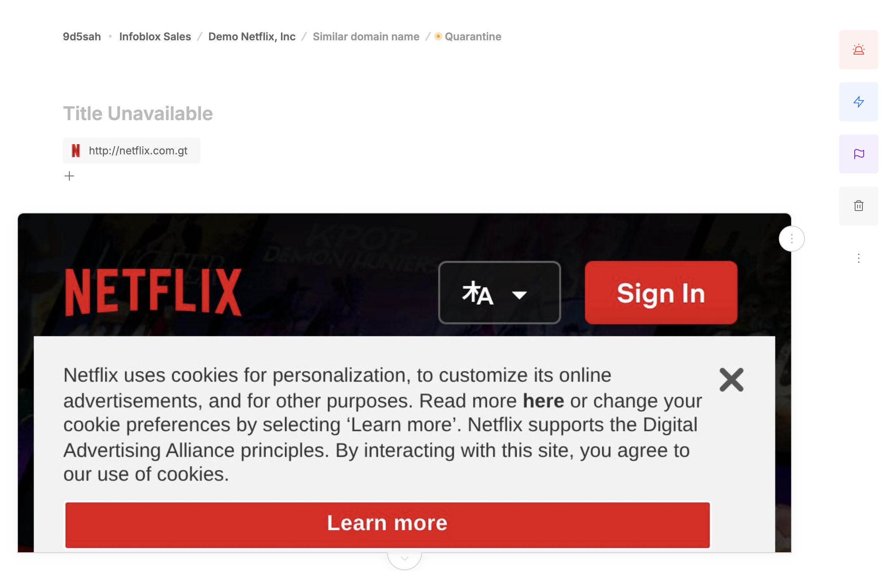
4. Look for signals such as branding overlap, impersonation patterns, hosting behavior, or campaign context.

#### Closed Tickets
**Steps**
1. Navigate to the closed tickets tab
2. Filter the ticket type to Phishing
3. Open one of the Phishing example associated with the Netflix asset
4. Review the ticket timeline, evidence, disposition, and final resolution
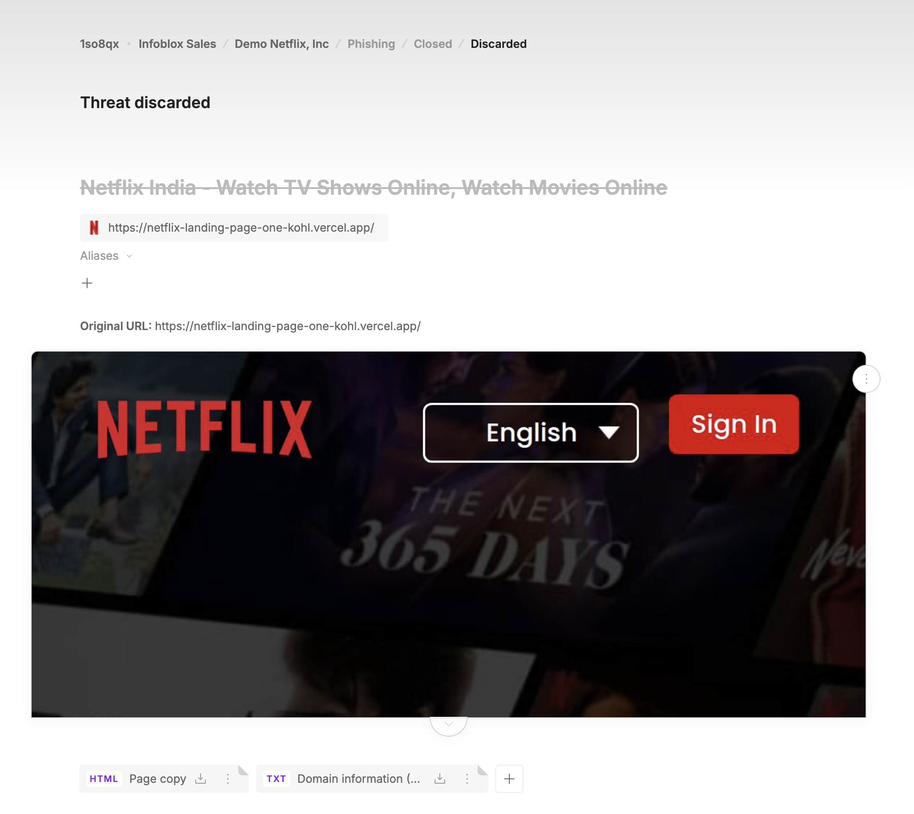

**What the participant should observe**
- How the original detection was investigated and validated.
- Which evidence and workflow actions led to the final resolution.
- How the closed ticket can be used in a customer conversation to demonstrate visibility, analyst decision-making, and measurable remediation outcomes.

#### Discarded Tickets
**steps**
1. From the Resolution drop-down select Discarded as an option
2. The reasons for discard can include:
3. ad is no longer available
4. content is no longer visible to users
5. the AI hit the content and saw it was inactive, then discarded it automatically

#### Takedown request for resolution
1. From the Treatment drop-down select the Takedown option
2. Select the Phishing ticket for the asset Netflix
3. Observe how completed workflows are documented
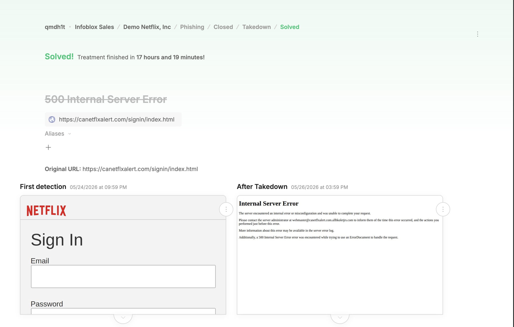
4. What “solved” appears to mean operationally
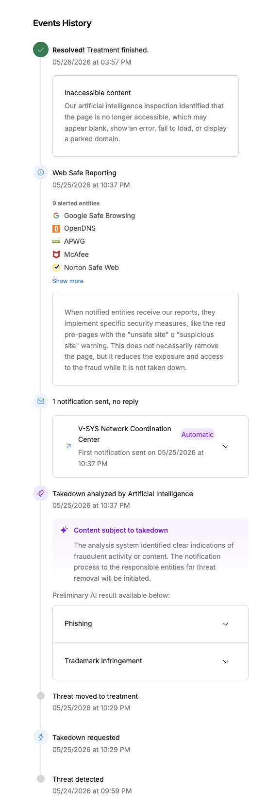

**Participants Exercise**
- Observe Which evidence or actions led to closure

## Data Leakage
### Goal
This section demonstrates how Axur identifies leaked credentials, sensitive information, and other data exposures associated with an asset.
Participants should assess the exposure’s relevance and understand how it can support investigation, risk reduction, and remediation.

### Exposed Credentials
**Steps**
1. Navigate to Workspaces > Data Leakage
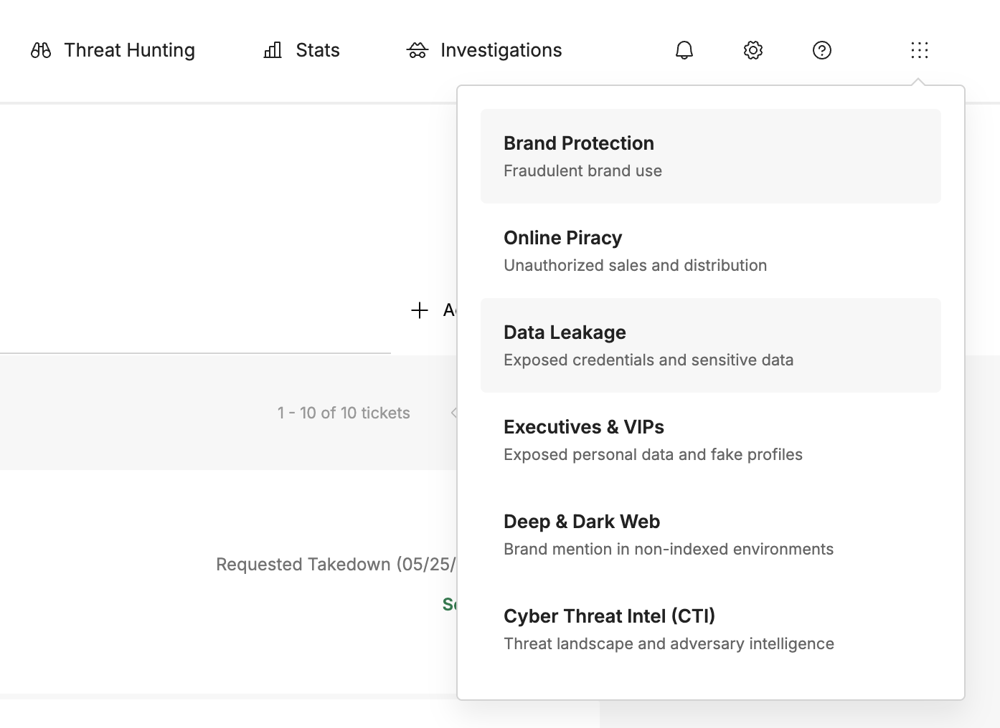
2. Open the credentials tab (if not already opened)
3. Observe that the filter is applied to status as New or in Treatment
4. Click on the Leak Format to select the format in which leak occured. select Table Format (Structured credential records, usually organized into fields such as username/email, password, and URL)
5. Select the Employee radio button to observe the employee credential leakage.
6. Similarly select the Customer radio button to observe customer credentials leakage while accessing sites related to the asset you are observing for this protection.
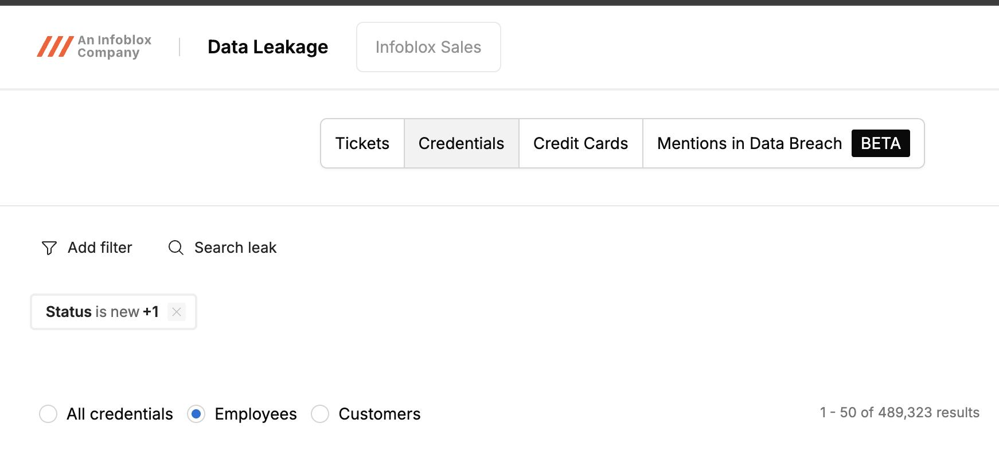
6. To review an exposed credentials record, select an entry and it will provide details of the leakage
7. Walk through the available details, such as:
- Source of the exposure
- Group or community where it was found
- File name
- Username, URL, and other available metadata
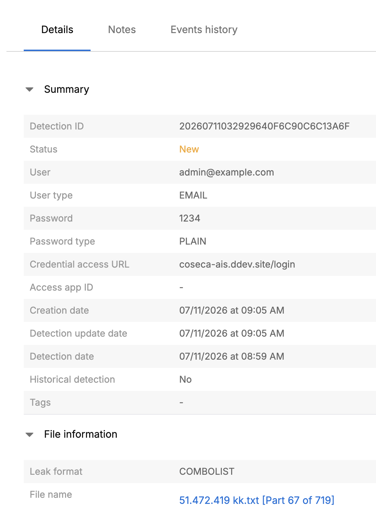
8. Select the leak format as Stealer Log and select on of the users from the list
9. Review the infected-machine context, original file or package information, malware details and related exposure evidence.
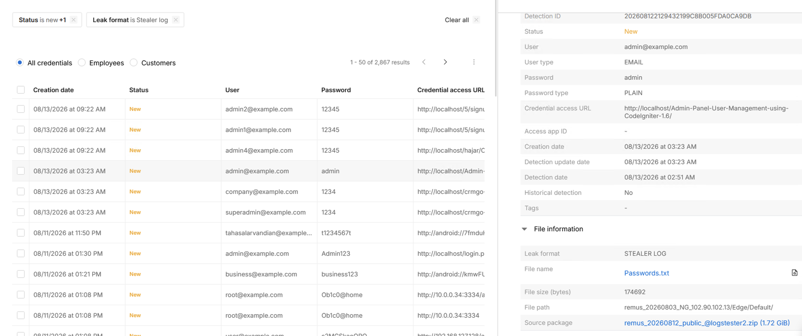

## Deep and Dark Web
### Goal
Explore Axure Deep and Dark Web option and how it sources brand mentions, leaked credentials, illicit discussions, and other threat intelligence relevant to an asset.

### Explore Page
**Steps**
1. Navigate to Workspace > Deep and Dark Web
2. Open the Explore page
3. Add a search filter - netflix AND (hack OR premium)
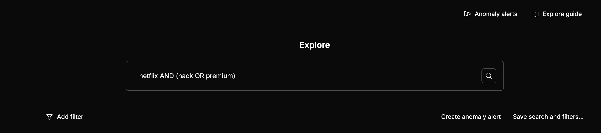
4. Select one of the filtered message
5. Review the findings and identify what makes a result relevant or irrelevant
6. Make a decision if it needs to be made a Ticket

## Executives and VIPs
### Goal
Explore how Axur monitors executives and VIPs for impersonation, targeted threats, fraudulent profiles, and exposed personal information. See how an executive compromise risk is often higher impact than general user exposure.

### Monitoring Impersonations
**Steps**
1. Navigate to Workspace > Executives & VIPs
2. Filter by Asset - Patrick Mahomes and Ticket Type - Personal Information leak
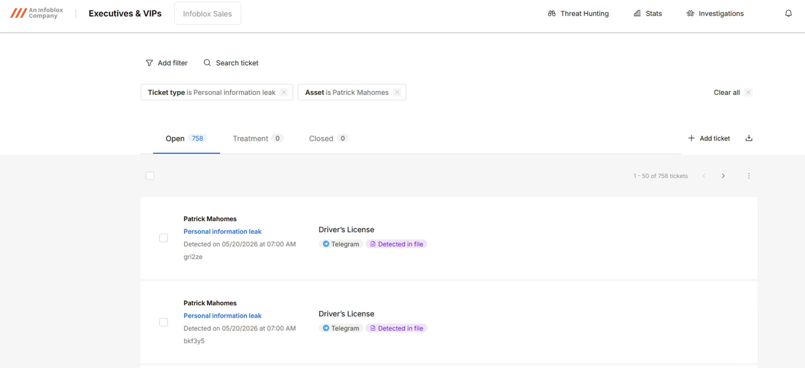
3. Open and review one of the open tickets tied to the executive
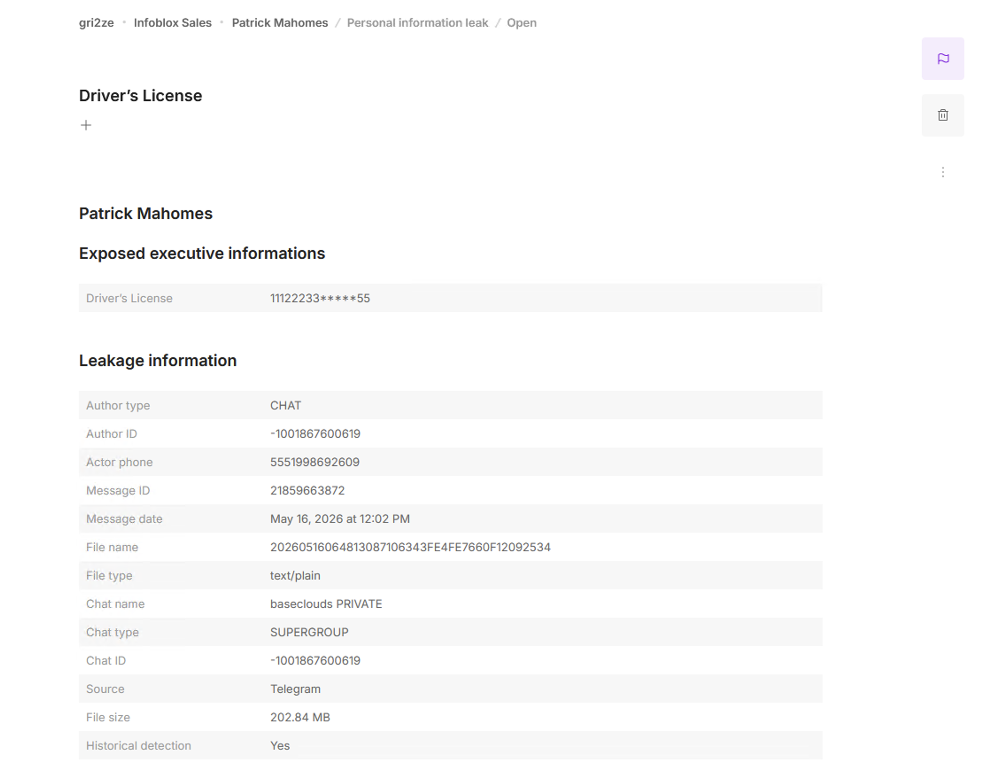
4. Review the recommended actions to understand the potential next steps to mitigate the threat
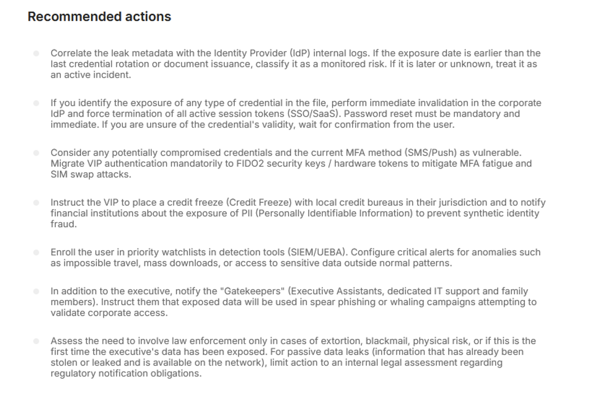

## Cyber Threat Intel (CTI)
### Goal
Explore how CTI and external attack surface data can support both operational investigations and executive reporting. It aggregates and analyzes cyber-intelligence sources, then provides contextualized insights and bulletins covering threats such as vulnerabilities, threat actors and indicators of compromise.
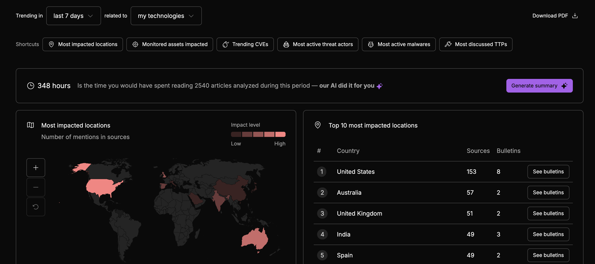

### Monitoring Rules
You can create monitoring rules based on technologies, malware, threat actors, geography, industry, and risk level. This helps security teams prioritize relevant threats, investigate proactively, and turn intelligence into informed defensive action.

Threats targeted at a specific location in a specific industry:

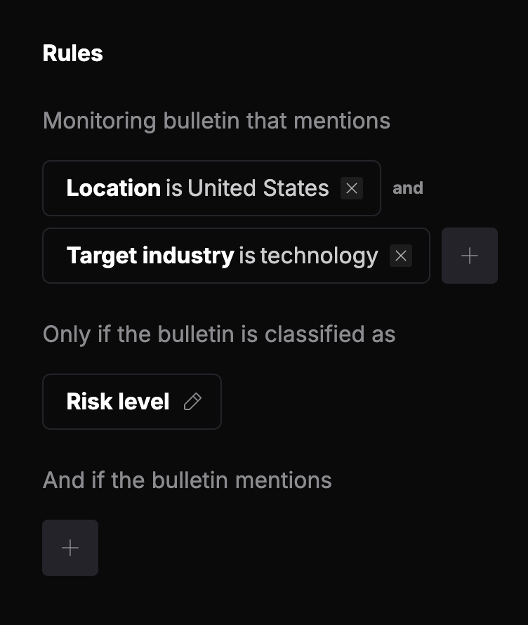

## External attack surface management (EASM)
**Steps**
1. Navigate to Workspace > External attack surface management (EASM)
2. The homepage provides a summary of the assets being monitored and affected
3. Select any of the monitored assets to review existing hosts, IPs, technology stack and open port entries.
4. The same section will also list out the Exposures associated with the selected asset for further investigation
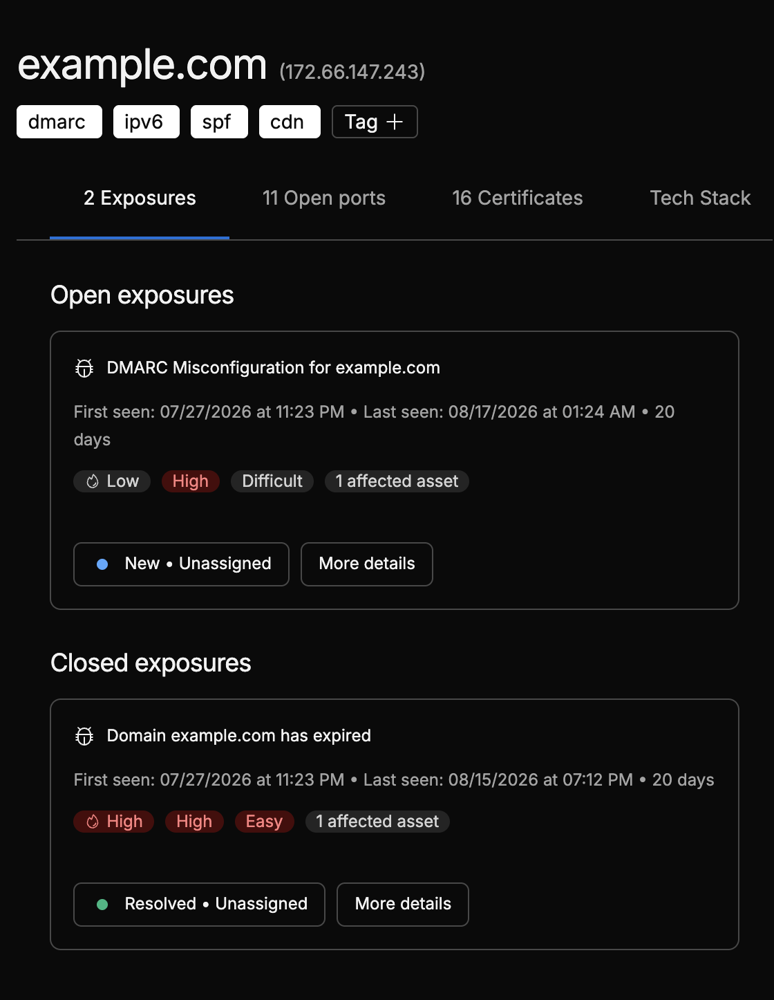

Outcome of this lab
===

In summary, Axur helps Infoblox move earlier in the attack lifecycle by identifying and disrupting external threats before they reach users. Combined with Infoblox protection at the DNS layer, it gives organizations a stronger and more preemptive way to reduce digital risk
