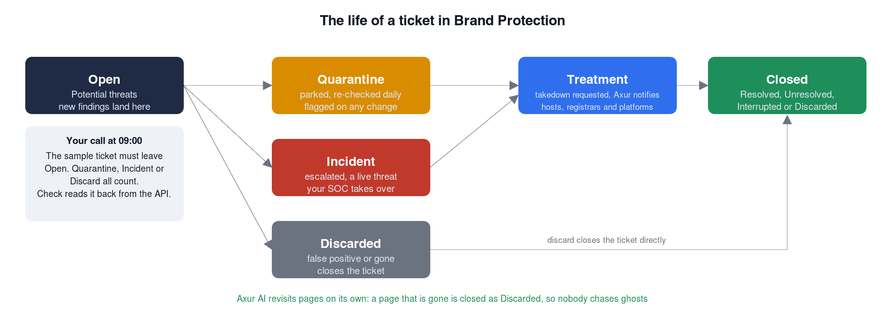

Day One on the Desk
===

Your badge works, your tenant is live, and four assets have been under watch since before you logged in:
the **Netflix** brand, the **example.com** domain, the **Microsoft** vendor and the executive **Alex Rivera**.
What follows is one shift, told hour by hour. Each chapter is a situation an analyst meets, what Axur does
about it, the clicks to see it, and a decision that is yours to make. Nothing you do here can affect anyone
else. The shift covers the core of the desk in about an hour. An optional **Overtime** challenge follows with
the tuning tools, the dark web, the executive, threat intelligence and your attack surface.

**About the screens in this guide.** They were taken in Axur's demo tenant, **Infoblox Sales**, where the
brand is registered as **Demo Netflix, Inc**. Your tenant uses the same asset name and the same screens. Only
the tenant name in the top bar, the ticket counts and the dates differ. Where a screen shows something that
takes time to appear in a fresh tenant, the text says so.

***

## Your badge

If the **Axur Portal** tab asks you to sign in again, or you skipped ahead, these are your credentials.
They are the same ones you picked up on the first page.

**Your Tenant Name:**
```
[[ Instruqt-Var key="AXUR_TENANT_NAME" hostname="shell" ]]
```

**Your Login Username:**
```
[[ Instruqt-Var key="AXUR_USER_EMAIL" hostname="shell" ]]
```

**Your Login Password:**
```
[[ Instruqt-Var key="AXUR_USER_PASSWORD" hostname="shell" ]]
```

***

## 08:00  Know what you protect
===

____

**The situation.** A takedown request, a phishing alert, a lookalike domain: all of it traces back to how well
the brand is described. Axur compares the internet against the asset file, so a precise file means precise
detections and a vague one means noise.

**Axur's edge.** During registration the platform assigns the brand an automatic **exposure level** from its
web traffic, which sets the right coverage. Add the official website, name variations, locales and logos and
the engines have something exact to match. Enable **Takedown Authorization** and the platform can act on your
behalf when it finds abuse.

**Steps**

1. Open the **Axur Portal** tab and sign in to Axur ONE
2. Navigate to Settings > Monitoring Settings

3. Select Asset Management
4. Open the **Demo Netflix, Inc** brand asset. Its brand name and variation is **Netflix**, which is what the collectors match
5. Review the visible metadata, the monitoring attached to it, and any linked coverage areas


**What to notice**

1. Which fields describe the asset (website, country, language, logos)
2. Which threat types are enabled under Brand Protection. Yours starts with phishing, lookalike domains, fake social media profiles and fraudulent brand use
3. Whether Takedown Authorization is configured. Some platforms only act on a signed authorization that carries the brand logo

***

## 09:00  The board lights up
===

____

**The situation.** An hour into the shift, and **Brand Protection** has findings for Netflix. Not one or two: within
minutes of the asset going live, Axur's collectors typically surface several hundred, from cloned login pages
on free hosting to casino sites trading on the name and domains one letter away from the real one. Most of the
pages carry a working login form, and a good share ask for payment.

**Axur's edge.** Every finding is a **ticket** with a lifecycle you control. A new ticket can be parked in
**Quarantine**, where Axur re-checks it every morning and flags any change, escalated as an **Incident**,
**Discarded** as a false positive, or sent for **Takedown**. Takedowns are what Axur is known for: the first
phishing notification goes out in under four minutes, 86% of requests run fully automated from detection to
decision to notification, and the success rate is around 98%, with a stay-down guarantee. Lookalike domains
need no setup at all: smart monitoring compares new registrations and certificates against the brand and opens a
ticket for each one. Parking the empty ones in Quarantine is your move, and Axur re-checks them every morning.



#### A fake profile wearing your logo

**Steps**

1. Navigate to Workspaces > Brand Protection

2. In **Search ticket**, type **golden**. That is the fastest way to it: the Fake social media profile filter alone returns well over a thousand real profiles by now
3. Open the sample ticket whose reference is **facebook.com/netflix.golden.lab.sample**. It stands for the Netflix Golden profile in the screen below and was placed in your tenant for this exercise, so please do not request a takedown on it
4. Review the profile details, the logo similarity, the risk level assigned by Axur AI and the attributes on the ticket


**Your call**

- Quarantine it, escalate it as an incident, or discard it as a false positive. This is the one decision the
  lab checks: when you press **Check**, the lab reads your tenant back from the Axur API and confirms the
  sample ticket has left Potential threats. Takedown is not offered on this sample, and please leave it that way

#### An incident of fraudulent brand use

**Steps**

1. Filter by Ticket Type and select **Fraudulent brand use**. In your tenant these sit in the **Open** tab until you escalate one. The demo screen shows the **Incidents** tab after that
2. Open one ticket. If the filter comes back empty, the collectors have not reached that source yet, so take a phishing ticket instead

3. Review the evidence and the current status
4. Walk through the possible actions:

- request a takedown
- move it to quarantine
- if it looks like a false positive, discard it

**Your call**

- Investigate one ticket and decide its next action

#### Lookalike domains in quarantine

**Steps**

1. In the **Open** tab, filter Ticket Type = **Similar domain name**
2. Open a few. Most resolve to an empty page or a parked domain, which is what a phishing page looks like the week before it goes live
3. Review how domain lookalikes are presented

4. Look for signals such as branding overlap, impersonation patterns, hosting behavior, or campaign context

**What to notice**

- These were found without anyone's help. Send an empty one to **Quarantine**: Axur re-checks quarantined tickets every morning at 06:00 and flags the ticket the day content appears. The demo screen shows one already parked there

#### The ones that are already closed

**Steps**

1. Navigate to the **Closed** tickets tab
2. Filter the ticket type to Phishing
3. Open a ticket tied to the Demo Netflix, Inc asset. The first closed tickets appear 15 to 20 minutes into your shift, once the AI has revisited today's findings. If the tab is still empty, carry on and come back
4. Review the timeline, the evidence, the disposition and the final resolution


**What to notice**

- Closed tickets carry one of four outcomes: Discarded, Resolved, Unresolved or Interrupted
- Which evidence and workflow actions led to the resolution
- How a closed ticket tells a customer the story of visibility, analyst judgement and measurable remediation

#### Discarded tickets

**Steps**

1. From the Resolution drop-down select **Discarded**
2. Typical reasons for a discard:

- the ad is no longer available
- the content is no longer visible to users
- the AI revisited the content, found it inactive, and discarded it automatically

#### Takedown as the resolution

**Steps**

1. From the Treatment drop-down select **Takedown**
2. Select a phishing ticket for the Demo Netflix, Inc asset. Nothing in your tenant has been sent for takedown yet, so this view fills only after you request one. The screens below show a finished takedown from the demo tenant, and the events history that got it there
3. Observe how completed takedowns are documented

4. Note what "solved" means operationally


**Your call**

- Which evidence or actions led to closure. The more evidence on a ticket, from screenshots to HTML, the higher the odds of removal

***

## 11:00  Someone is selling your passwords
===

____

**The situation.** Your second asset is the corporate domain, example.com. Somewhere a combolist carries an
employee's password, and somewhere a laptop infected with an info-stealer has been quietly uploading every
saved login, including the one to your VPN.

**Axur's edge.** **Data Leakage** separates what a business must treat differently: **employee credentials**,
which are a route into your systems, and **customer credentials**, which are account takeover waiting to
happen. Stealer logs come with the infected machine's context, so you can tell an old breach from active
malware. Secrets committed to public code are caught as well.

**Steps**

1. Navigate to Workspaces > Data Leakage and open the **Credentials** tab

2. The filter already applied is Status **New** or **In treatment**. Click **Add filter**, choose **Leak format** and select **Combolist**: the bulk of what leaks about example.com, thousands of records within minutes of the asset going live
3. Select the **Employees** radio button for leaked employee credentials, then **Customers** for customer credentials captured on sites related to the domain

4. Open a record and walk through what is there: the source and the forum or community where it was found, the leak's name and description, the file it came from, the username, the password type and the URL it grants access to

5. The other leak format is **Stealer log**. example.com is a documentation domain, no real laptop is logged into it, so a fresh tenant has no stealer logs for it. The record below comes from the demo tenant: the infected machine's file path, the browser profile and the source package, which is what turns a leaked password into an infected computer you can find


**Your call**

- Which of these leaks would you escalate first, and who in the company needs to know today

***

## 14:00  Your vendor's problem is your problem
===

____

**The situation.** Your third asset is not yours at all. Microsoft is a vendor, and a ransomware announcement
or a leaked corporate credential at a supplier becomes your incident the moment you depend on them.

**Axur's edge.** **Supply Chain Intel** keeps a living report per vendor: an AI summary of its posture,
security bulletins with the categories you care about flagged as critical, its attack surface, leaked employee
and customer credentials, and dark web mentions, each with week-over-week or month-over-month trend
indicators. A ransomware group naming a supplier often shows up here before mainstream news, and the whole
report exports to PDF for the people who need it.

**Steps**

1. Open the **Supply Chain Intel** workspace and select the **Microsoft** vendor
2. Read the **Overview**: main domain, corporate name and last update
3. Open **Threat Landscape** and read the AI summary, then filter the bulletins with **Only critical**
4. Browse **Attack Surface**, **Employee Credentials**, **Customer Credentials** and **Dark Web**, and note the trend indicators

**Your call**

- Which of these would you raise with the team that owns the Microsoft relationship, and how urgently

***

## 17:00  End of shift
===

____

In one shift you watched Axur fill the board with real findings within minutes of the brand going live, made
the call on a fake profile, followed a leaked password to the forum it was traded in and checked on a supplier
before the news did. That is the external half of the picture.

Axur helps Infoblox move earlier in the attack lifecycle by identifying and disrupting external threats before
they reach users. Combined with Infoblox protection at the DNS layer, it gives organizations a stronger and
more preemptive way to reduce digital risk.

***

## Key takeaways
===

____

One shift, five things to carry back to your own organisation:

- **Brand Protection.** A brand registered at 08:00 had several hundred findings by 09:00: cloned login
  pages, lookalike domains and sites trading on the name. Axur finds the fraud before your customers report it.
- **Takedown.** One click starts it, and Axur runs the notification chain with hosting providers, registrars
  and platforms until the content is gone. Pages that die on their own are closed by the AI, so nobody
  chases ghosts.
- **Credential exposure.** Leaked passwords arrive with their source. A 2017 combolist and yesterday's stealer
  log are different emergencies, and the stealer log tells you which machine is infected.
- **Supply Chain Intel.** Your vendor's ransomware announcement or leaked credential is your incident. Axur
  tells you before the mainstream news does.
- **API first.** Everything this lab did to your tenant, from creation to the Check button, went through the
  public API. Provisioning, configuration and validation are scripts, which is what a managed service or a
  large security team needs.

**Overtime is next, and it is optional.** It holds the tuning tools (keyword libraries, filtering rules and
search bots), the deep and dark web, the executive, threat intelligence and your attack surface. Short on
time? Open it and press **Next** to go straight to the debrief: four short questions about the calls you made
today, with the answers and the reasoning behind them after the last one.

Your tenant is suspended automatically when this lab ends.
