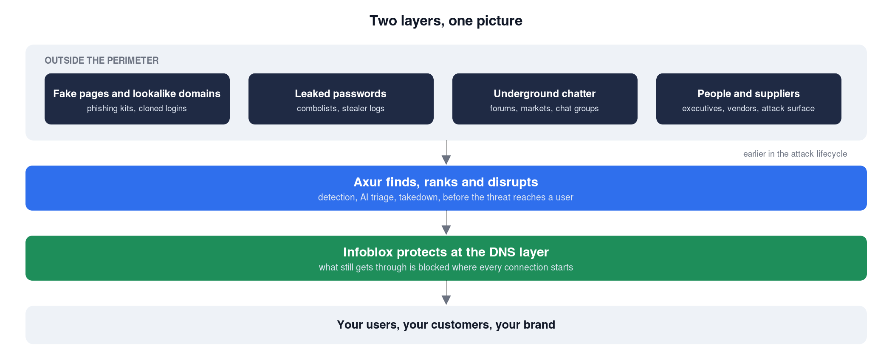

Clock out
===

Your shift is over. Here is the reasoning behind the four calls you just made, and what each one says about
working with Axur.

***

## The domain that is not there yet
===

____

**The call: leave it in Quarantine.** An empty lookalike domain is not a false positive. It is a phishing
page that has not been built yet. Quarantine keeps it under Axur's daily re-check, so the day content
appears the ticket comes back with the change flagged. Discarding it means finding it again from scratch. A
takedown needs evidence of abuse, and an Incident is for a threat that is already live.

**Takeaway.** Axur follows a threat through its whole life, from the certificate log to the takedown. You
decide once and the platform keeps watching.

***

## Two leaks, one afternoon
===

____

**The call: Record B first.** A stealer log from yesterday means a machine is infected right now, and the
credential is fresh and paired with the URL of your own login page. Record A is an old, already known
password. The source and the date set the priority, not the word "employee".

**Takeaway.** Axur delivers credentials with their provenance, so the response is proportional and the
infected machine is found before the credential is used.

***

## The ticket that closed itself
===

____

**The call: normal, and a good sign.** Phishing kits are short-lived. Axur's AI revisits pages and closes
the ones that are gone, so analysts and takedown effort go to pages that are still live. Discarded means
"no longer a threat". It does not mean the takedown failed, and it does not mean the page was safelisted.

**Takeaway.** The platform cleans up after the attackers, so your queue stays honest and your team's time
goes where the risk is.

***

## The supplier on the news
===

____

**The call: assess your own exposure and open an internal ticket.** You cannot take down a ransomware
group's leak site, and you should not wait for a press release. What you can do is map what the vendor holds
and reaches in your environment, which integrations and shared tokens exist, and hand that to the owners of
the relationship before the news breaks.

**Takeaway.** Supply Chain Intel turns third-party news into your own action list, hours or days early.

***

## What to take home
===

____

Everything you worked with today was a real tenant with real findings, created for this session through
the Axur API. The brand was Netflix and the domain was example.com. Picture the same shift with your own
brands, your own domains, your executives and your vendors.

- **Outside the perimeter is where most attacks start.** Fake pages, lookalike domains, leaked passwords and
  supplier incidents never touch your firewall. Axur sees them.
- **Detection alone is not the product.** Ranking, automation, takedown and AI clean-up are what turn a feed
  into a working desk.
- **Axur and Infoblox.** Axur finds and disrupts external threats before they reach users. Infoblox protects
  at the DNS layer. Together they move defence earlier in the attack lifecycle.

Ask your Infoblox account team what an Axur assessment would show for your own assets.

Your tenant is suspended automatically when this lab ends. Thank you for the shift.
